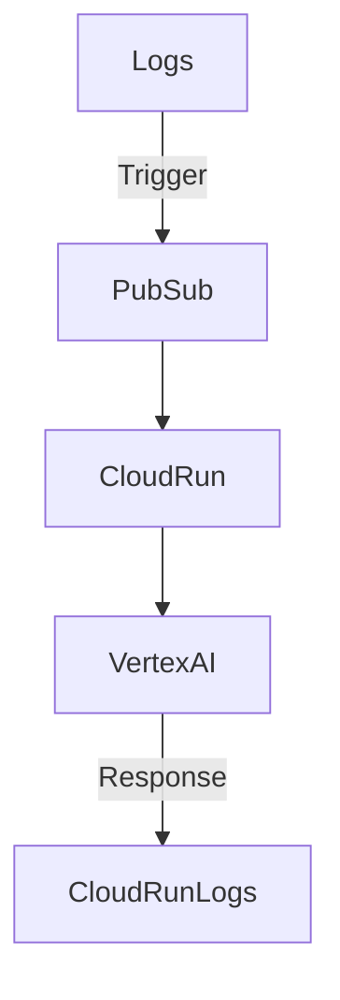
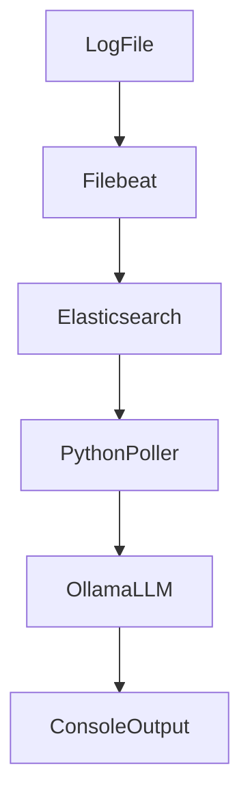

# 🧠 AI-Powered Log Analysis – Case Study Report

This project compares two approaches for intelligent log analysis and automated issue resolution:

- ✅ **Use Case 1: Google Cloud Vertex AI + Cloud Run**
- 🖥️ **Use Case 2: Local EFK Stack + LLaMA 3.2 via Ollama**
- 🧩 **Bonus: Real-Time Agentisation Potential**
- ⚖️ **Comparison, Limitations, and Future Work**

---

## ✅ Use Case 1: Google Cloud Vertex AI

### 🔧 Tools Used
- Google Cloud Logging + Log-based Alerting
- Cloud Pub/Sub
- Cloud Run (Python Flask app)
- Vertex AI (Gemini 2.0 Flash Lite model)
- gcloud CLI (for simulated logs)

### 🔁 Architecture Flow

### Flow

1. `generate_logs.sh` emits logs using `gcloud logging write`
2. Cloud Log Alert triggers when severity = ERROR
3. Alert sends a message to a Pub/Sub topic `log-alerts`
4. A Cloud Run function subscribed to the topic receives and parses the log
5. It sends the log content to **Vertex AI (`gemini-2.0-flash-lite-001`)**
6. The LLM returns a root cause analysis and suggested fix
7. Output is printed to Cloud Run logs (could be extended to email/Slack)

### Highlights

- Zero infra management (fully serverless)
- Real-time log triage and response
- Robust, scalable, and production-ready setup

---

## 🖥️ Use Case 2: Local EFK Stack + Ollama LLM

### 🔧 Tools Used
- Dockerized EFK (Elasticsearch + Filebeat + Kibana)
- Local logs from `logs/test.log`
- Python poller for new logs from ES
- Ollama running `llama3.2` locally

### 🔁 Architecture Flow

### Flow

1. Logs are stored in `logs/test.log`
2. Filebeat tails logs and sends them to Elasticsearch
3. Kibana dashboard visualizes logs (by severity, timeline, etc.)
4. `log_tail_llm.py` polls Elasticsearch for `ERROR` logs
5. For each new relevant log entry:
    - Sends it to the local LLM via Ollama API
    - Gets a human-readable explanation and resolution
6. All responses are printed locally

### Highlights

- Fully local and free to run (except resource costs)
- Transparent, extensible, open-source pipeline
- Works offline with downloaded LLMs (e.g., LLaMA 3.2)
---

## 🧩 Bonus: Real-Time Agentisation

### GCP (Use Case 1)
- Cloud Functions/Workflows could be chained after LLM output
- Auto-remediation, Slack alerts, or dashboarding

### Local (Use Case 2)
- Python poller could trigger scripts or alerts (e.g., Windows Notifications or shell commands)

---

### ✅ Feature Comparison Table

| Feature / Aspect             | **Use Case 1: GCP Vertex AI**                                 | **Use Case 2: Local EFK Stack + LLaMA (Ollama)**              |
|-----------------------------|---------------------------------------------------------------|----------------------------------------------------------------|
| **Platform Type**           | Managed Cloud (Google Cloud Platform)                        | Self-hosted (Docker-based on local machine)                   |
| **Log Collection**          | Cloud Logging → Log-based Alerts                             | Filebeat → Elasticsearch → Kibana                             |
| **Trigger Mechanism**       | Real-time (Pub/Sub → Cloud Run trigger)                      | Polling (Python script queries Elasticsearch periodically)     |
| **AI Model**                | `gemini-2.0-flash-lite-001` (Vertex AI in `us-central1`)     | `llama3.2` via Ollama                                          |
| **Model Invocation**        | On `ERROR` logs only (filter applied in Cloud Logging Alert) | All logs matched in query (`ERROR`)        |
| **Response Time**           | Fast (serverless + cloud GPUs)                               | Slower (CPU-bound, hardware dependent)                         |
| **Extensibility**           | Excellent (Workflows, Eventarc, Notifier, Monitoring)         | Moderate (custom scripting or REST integration)                |
| **Output Handling**         | AI response printed in Cloud Run logs                        | Printed directly in local terminal                             |
| **Setup Complexity**        | Moderate (IAM roles, service account, Cloud Run deployment)  | Moderate (volume mounts, file paths, Docker networking)        |
| **Cost**                    | Free (within GCP free tier)                                  | Free (hardware dependent, no SaaS fees)                        |
| **Scalability**             | High (auto-scaling with Cloud Run)                           | Low (limited to local resources)                               |
| **Automation Potential**    | High (event-driven + serverless)                             | Medium (via polling & manual orchestration)                    |
| **Production Readiness**    | ✅ Yes                                                        | ⚠️ No — prototype/local PoC                                    |

---

### ⚖️ Summary Highlights

- **Use Case 1: Google Cloud Vertex AI**
  - Real-time analysis pipeline with serverless execution
  - Scalable, cost-efficient, and suitable for production deployment
  - Easy integration with cloud-native workflows and automation tools

- **Use Case 2: Local EFK Stack + LLaMA**
  - Effective for local, offline prototyping and testing
  - Offers full control, no external cost, but limited in performance and scale
  - Ideal for experimentation where data privacy or cloud access is restricted

---

## ⚠️ Limitations Faced

### Limitations

1. **Performance Constraints on Local Machine**
   - Running the open-source LLM (`llama3.2` via Ollama) locally proved to be extremely slow on older hardware.
   - Response latency was significant, making the solution less practical for real-time use without GPU acceleration or higher-end CPUs.

2. **Limited Evaluation Metrics**
   - The comparison between Use Case 1 and Use Case 2 was primarily qualitative.
   - No objective accuracy or latency benchmarks were captured to quantify LLM effectiveness.

3. **Basic Log Ingestion**
   - In both use cases, logs were synthetically generated.
   - A more robust dataset from real-world systems could provide more meaningful testing and training potential.

4. **Simplified LLM Prompts**
   - Prompts to the LLMs were kept straightforward; more context-rich prompts or prompt-engineering strategies could yield better results.

5. **Security & Cost Awareness**
   - In Use Case 1, using Gemini models requires Vertex AI permissions and potential costs beyond the free tier.
   - In Use Case 2, Dockerized solutions pose local security and resource challenges on limited hardware.

---

## 🔮 Future Improvements

1. **Quantitative Evaluation**
   - Implement and log metrics such as:
     - Average LLM response time
     - Prompt-to-response accuracy (via human evaluation)
     - Token usage and latency per log event

2. **Real-Time Alerting and Remediation**
   - Integrate with notification services like Slack or email alerts.
   - Apply remediation rules automatically based on LLM suggestions using cloud workflows or local bash triggers.

3. **Richer LLM Capabilities**
   - Switch from basic summarization to **retrieval-augmented generation (RAG)** by linking logs with structured knowledge base documents.
   - Explore fine-tuning open-source LLMs on historical log data for tailored behavior.

4. **Scalable Cloud Alternative**
   - Move the open-source stack to a cloud VM or container service to overcome hardware limitations while retaining cost control.

5. **Anomaly Detection Integration**
   - Extend both pipelines with classical ML models (e.g., Isolation Forest, Autoencoders) to flag outliers before passing to the LLM for explanation.

---

## 📂 How to Run

### Use Case 1 (GCP)
- Set up Cloud Logging sink → Pub/Sub → Cloud Run
- Python function uses `vertexai.preview.language_models.ChatModel`
- IAM: Grant Vertex AI User to Cloud Run default SA
- Use `gcloud logging write` to test

### Use Case 2 (Local)
- Run `docker-compose up -d` for EFK stack
- Tail logs in `logs/test.log`
- Start LLaMA model: `ollama run llama3.2`
- Run `log_tail_llm.py` to fetch logs and print LLM response

---

🧾 Author: Konstantinos Soufleros  
📅 Date: May 2025

---